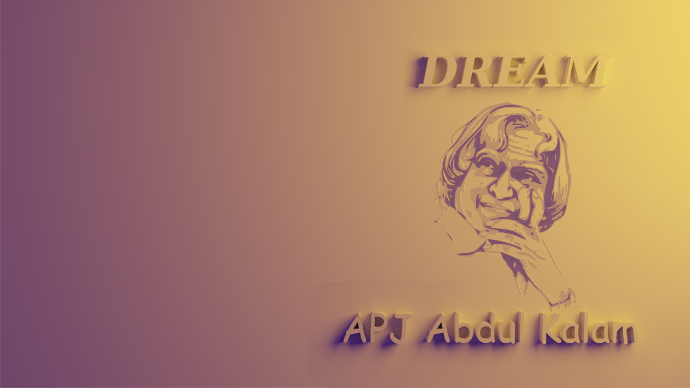

# Image Manupulation using PILLOW Library

### Generate Single color image

Image.new(mode, size, color)

``` python
    from PIL import Image

    # Create a red image with width and height of 100 px
    img1 = Image.new('RGBA',(100,100),'red')

    img1.save('red_image.png')
```

  output:
    

---

### Color List
Standard color names its RGBA value as per CSS 1 used in Pillow library
```python
    colormap = {
        # colour names used in CSS 1.
        "aliceblue": "#f0f8ff",
        "antiquewhite": "#faebd7",
        "aqua": "#00ffff",
        "aquamarine": "#7fffd4",
        "azure": "#f0ffff",
        "beige": "#f5f5dc",
        "bisque": "#ffe4c4",
        "black": "#000000",
        "blanchedalmond": "#ffebcd",
        "blue": "#0000ff",
        "blueviolet": "#8a2be2",
        "brown": "#a52a2a",
        "burlywood": "#deb887",
        "cadetblue": "#5f9ea0",
        "chartreuse": "#7fff00",
        "chocolate": "#d2691e",
        "coral": "#ff7f50",
        "cornflowerblue": "#6495ed",
        "cornsilk": "#fff8dc",
        "crimson": "#dc143c",
        "cyan": "#00ffff",
        "darkblue": "#00008b",
        "darkcyan": "#008b8b",
        "darkgoldenrod": "#b8860b",
        "darkgray": "#a9a9a9",
        "darkgrey": "#a9a9a9",
        "darkgreen": "#006400",
        "darkkhaki": "#bdb76b",
        "darkmagenta": "#8b008b",
        "darkolivegreen": "#556b2f",
        "darkorange": "#ff8c00",
        "darkorchid": "#9932cc",
        "darkred": "#8b0000",
        "darksalmon": "#e9967a",
        "darkseagreen": "#8fbc8f",
        "darkslateblue": "#483d8b",
        "darkslategray": "#2f4f4f",
        "darkslategrey": "#2f4f4f",
        "darkturquoise": "#00ced1",
        "darkviolet": "#9400d3",
        "deeppink": "#ff1493",
        "deepskyblue": "#00bfff",
        "dimgray": "#696969",
        "dimgrey": "#696969",
        "dodgerblue": "#1e90ff",
        "firebrick": "#b22222",
        "floralwhite": "#fffaf0",
        "forestgreen": "#228b22",
        "fuchsia": "#ff00ff",
        "gainsboro": "#dcdcdc",
        "ghostwhite": "#f8f8ff",
        "gold": "#ffd700",
        "goldenrod": "#daa520",
        "gray": "#808080",
        "grey": "#808080",
        "green": "#008000",
        "greenyellow": "#adff2f",
        "honeydew": "#f0fff0",
        "hotpink": "#ff69b4",
        "indianred": "#cd5c5c",
        "indigo": "#4b0082",
        "ivory": "#fffff0",
        "khaki": "#f0e68c",
        "lavender": "#e6e6fa",
        "lavenderblush": "#fff0f5",
        "lawngreen": "#7cfc00",
        "lemonchiffon": "#fffacd",
        "lightblue": "#add8e6",
        "lightcoral": "#f08080",
        "lightcyan": "#e0ffff",
        "lightgoldenrodyellow": "#fafad2",
        "lightgreen": "#90ee90",
        "lightgray": "#d3d3d3",
        "lightgrey": "#d3d3d3",
        "lightpink": "#ffb6c1",
        "lightsalmon": "#ffa07a",
        "lightseagreen": "#20b2aa",
        "lightskyblue": "#87cefa",
        "lightslategray": "#778899",
        "lightslategrey": "#778899",
        "lightsteelblue": "#b0c4de",
        "lightyellow": "#ffffe0",
        "lime": "#00ff00",
        "limegreen": "#32cd32",
        "linen": "#faf0e6",
        "magenta": "#ff00ff",
        "maroon": "#800000",
        "mediumaquamarine": "#66cdaa",
        "mediumblue": "#0000cd",
        "mediumorchid": "#ba55d3",
        "mediumpurple": "#9370db",
        "mediumseagreen": "#3cb371",
        "mediumslateblue": "#7b68ee",
        "mediumspringgreen": "#00fa9a",
        "mediumturquoise": "#48d1cc",
        "mediumvioletred": "#c71585",
        "midnightblue": "#191970",
        "mintcream": "#f5fffa",
        "mistyrose": "#ffe4e1",
        "moccasin": "#ffe4b5",
        "navajowhite": "#ffdead",
        "navy": "#000080",
        "oldlace": "#fdf5e6",
        "olive": "#808000",
        "olivedrab": "#6b8e23",
        "orange": "#ffa500",
        "orangered": "#ff4500",
        "orchid": "#da70d6",
        "palegoldenrod": "#eee8aa",
        "palegreen": "#98fb98",
        "paleturquoise": "#afeeee",
        "palevioletred": "#db7093",
        "papayawhip": "#ffefd5",
        "peachpuff": "#ffdab9",
        "peru": "#cd853f",
        "pink": "#ffc0cb",
        "plum": "#dda0dd",
        "powderblue": "#b0e0e6",
        "purple": "#800080",
        "rebeccapurple": "#663399",
        "red": "#ff0000",
        "rosybrown": "#bc8f8f",
        "royalblue": "#4169e1",
        "saddlebrown": "#8b4513",
        "salmon": "#fa8072",
        "sandybrown": "#f4a460",
        "seagreen": "#2e8b57",
        "seashell": "#fff5ee",
        "sienna": "#a0522d",
        "silver": "#c0c0c0",
        "skyblue": "#87ceeb",
        "slateblue": "#6a5acd",
        "slategray": "#708090",
        "slategrey": "#708090",
        "snow": "#fffafa",
        "springgreen": "#00ff7f",
        "steelblue": "#4682b4",
        "tan": "#d2b48c",
        "teal": "#008080",
        "thistle": "#d8bfd8",
        "tomato": "#ff6347",
        "turquoise": "#40e0d0",
        "violet": "#ee82ee",
        "wheat": "#f5deb3",
        "white": "#ffffff",
        "whitesmoke": "#f5f5f5",
        "yellow": "#ffff00",
        "yellowgreen": "#9acd32",
    }
```

----
### Adding logo to image
Before adding logo to image

Logo


Code:
```python
from PIL import Image

logo = Image.open('assets/logo.png')

bg = Image.open('assets/yt_banner2.png')
bg.paste(logo,(10,500),logo)
bg.save('sv_yt.png')

```
Result:


----
### Rotate an Image

Original Image


Code
``` python

from PIL import Image

logo = Image.open('assets/sigma.png')

logo_90 = logo.rotate(90)
logo_90.save('logo_90.png')

logo_45 = logo.rotate(45)
logo_45.save('logo_45.png')

logo_180 = logo.rotate(180)
logo_180.save('logo_180.png')

logo_270 = logo.rotate(270)
logo_270.save('logo_270.png')

logo_flip_right = logo.transpose(Image.FLIP_LEFT_RIGHT)
logo_flip_right.save('logo_flip_right.png')


logo_flip_top = logo.transpose(Image.FLIP_TOP_BOTTOM)
logo_flip_top.save('logo_flip_top.png')
```

Out Put:


---
### Adding text to image
Image before ading text


Code:
```python
from PIL import Image, ImageFont, ImageDraw

# Using a banner image
base = Image.open('assets/yt_banner1.png')

# creating a text layer with transparent data
txt = Image.new('RGBA',base.size,'#ffffff00')

# importing fonts
fnt = ImageFont.truetype("assets/fonts/FreeMono.ttf",20)
fnt1 = ImageFont.truetype("assets/fonts/DejaVuSans.ttf",80)

#data to add on the image
title = "Skill Disk"
tag_line = "Friend for your skill development"
social_media = "Facebook\nTwitter\nTelegram\nYoutube"

#drawinging text over image
d = ImageDraw.Draw(txt)
d.text((20,100),title,font=fnt1, fill="#ffaa00",align="center", stroke_width=2, stroke_fill='#2a2a2a' )
d.text((20,200),tag_line,font=fnt, fill="#000000",align="center" )
d.multiline_text((20,600),social_media,font=fnt, fill="#ffffff",align="left" )

#draw a line
d.line([(20,190),(400,190)],fill="#ffffff",width=5)

#Add text over the base image
out = Image.alpha_composite(base,txt)


out.save('text_banner.png')

```
Output:
