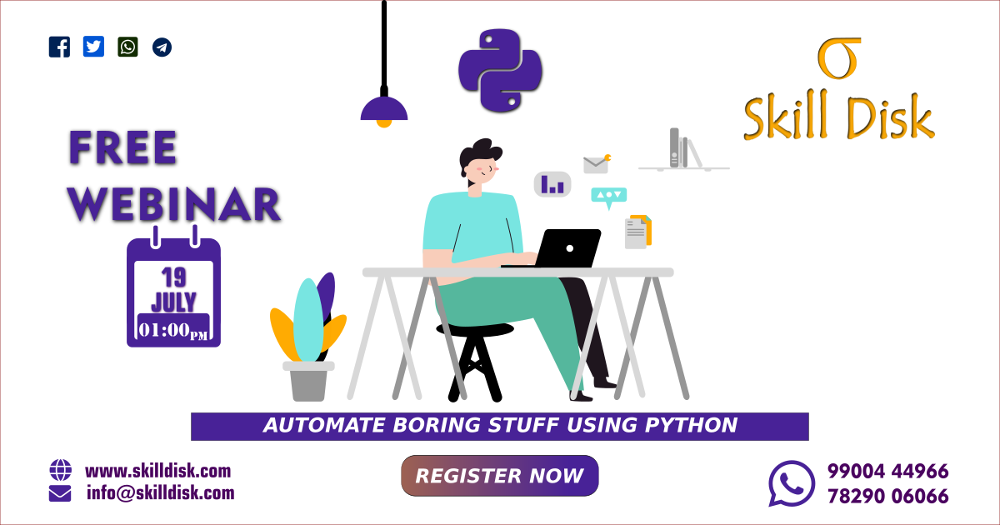

# Free Webinar on "AUTOMATE BORING STUFF USING PYTHON"
Follow me on [![alt text][1.1]][1]
[![alt text][2.1]][2]
[![alt text][3.1]][3] 

---- 

##### Download and work along with us in the webinar
#### Topics Covered
1. [Email Automation](email)
    - [Sending basic email through python code.](email/basic_email.py)
    - [Sending html content as email body.](email/html_email.py)
    - [Add attachemnt to the email.](email/email_attachment.py)
    - [Send automated mass mail.](email/mass_mail.py)

2. [Image Manupulation](Image)
    - [Generating images using PIL library.](image/gen_image.py)
    - [Adding logo to batch of image.](image/logo_image.py)
    - [Adding text ( water mark ) to an image.](image/text.py)
    - [Adding filters to image.](image/filters.py)

👉 Join our Webinar to update your Python skill and to know emerging trends in technology.

👉 Work along with us, using the code snippets provided at the time of webinar.

👉 The main focus of the webinar will be on delivering value to everyone who participates in the webinar.

👉 Skill Disk Webinar is organized to develop a passion for learning in you so that you will never stop to Grow.

So, connect with us for making this event more useful and valuable.
🔸 Date:- 19th July 2020 ( Sunday )🔸
⏰ Time:- 01:00 PM to 03:00 PM

👉Book Your Seats Now: http://skilldisk.com/contact/enroll/

Stay Home. Stay Safe. Learn Online & Get Certified

For more info call us or WhatsApp on :
☎ +91-9900444966
+91-7829006066

Visit: http://www.silldisk.com

Connect with our social media account

[![alt text][1.1]][1]
[![alt text][2.1]][2]
[![alt text][3.1]][3] 

<!-- icons with padding -->
[1.1]: http://i.imgur.com/tXSoThF.png
[2.1]: http://i.imgur.com/P3YfQoD.png
[3.1]: http://i.imgur.com/0o48UoR.png

<!-- links to social media accounts -->
[1]: http://www.twitter.com/skilldisk
[2]: http://www.facebook.com/skilldisk
[3]: http://www.github.com/skilldisk